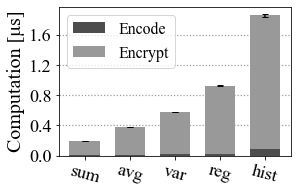
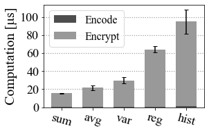
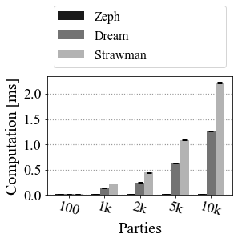
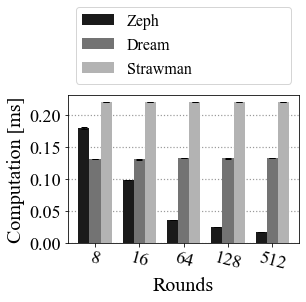
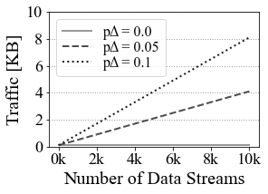
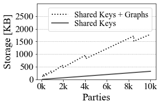
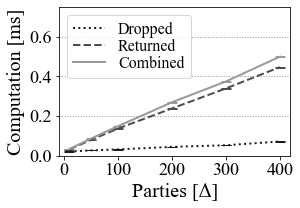
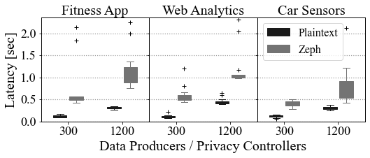

## Zeph

This repository contains the artifact for the OSDI 2021 submission ["Zeph: Cryptographic Enforcement of End-to-End Data Privacy"](osdi21-paper210-zeph.pdf). 

The current implementation of Zeph is an academic proof-of-concept prototype. The prototype is designed to focus on evaluating the overheads of enforcing privacy transformations on encrypted data streams in Apache Kafka/Kafka Streams. The current prototype is not meant to be directly used for applications in productions. Note that currently - and as we mentioned in our submission - the orchestration of transformation, i.e., the policy manager's role is emulated with ansible scripts that run the end-to-end benchmark. 

This repository is structured as follows.
For more information, see the individual README files in the corresponding folders.

#### Zeph Components

- [**Zeph-client**](zeph-client/README.md): This folder contains Zeph's client library's implementation. It contains the data producer and privacy controller implementation.

- [**Zeph-server**](zeph-server/README.md): This folder contains Kafka's server library implementation. In its essence, the data transformer is a stream processor that performs privacy-preserving transformations on encrypted data streams by leveraging a stream of privacy transformation tokens.

#### Zeph Utility

- [**Zeph-crypto**](zeph-crypto/README.md): This folder holds the implementation of the cryptographic material for Zeph. It contains the native implementation of the secure aggregation protocol for the Strawman, Dream, and Zeph Optimization and the implementation of the stream encryption.

- [**Zeph-shared**](zeph-shared/README.md): This folder holds the implementations of the shared components of the client and the server of Zeph (e.g., Avro record, pojo, serde).

#### Zeph Benchmarks and Evaluation

- [**Zeph-benchmarks**](zeph-benchmarks/README.md): This folder holds all the material relevant to the microbenchmarks and the end-to-end evaluation of Zeph. Zeph Dashboard and a demo of Zeph as well can be found in this folder.

- [**Ansible**](ansible/README.md): The ansible playbooks we made to help and assist in navigating and automatically setting up and running the benchmarks on AWS for Zeph.

## Experiments

We provide a [JupyterLab](https://jupyterlab.readthedocs.io/en/stable/) environment to run the experiments and evaluate the artifact of Zeph.
Our JupyterLab environment contains further documentation, runnable code cells to run benchmarks locally or on AWS (using `!` to run shell commands), and runnable code cells to recreate the plots from the paper. 

To execute a selected cell, either click on the run button in the toolbar or use `Ctrl + Enter`.
To keep the JupyterLab readable, cells containing longer code sections to create plots are initially collapsed (indicated by three dots). However, by clicking on the dots, the cell containing the code expands (`View/Collapse Selected Code` to collapse the code again).

**Note that the shell commands to execute benchmarks are by default commented out. Uncomment to initiate the runs for these benchmarks.** (remove `#` before or `"""` enclosing the shell command)

#### AWS
AWS login information can be found in the Artifact submission system. This will allow the  Artifact reviewers to run the evaluation on the same resources stated in the paper submission. The experiments on AWS are automated with ansible-playbooks and can be called from the JupyterLab environment.

**Please ensure that the AWS resources are cleaned up if they are not used in the artifact**  
If the playbook terminates normally (i.e., without error and is not interrupted), then the playbook ensures that the created resources are also cleaned up.
When in doubt, please run the `ansible/awscleanup.yml` playbook with the command below or contact the authors to avoid unnecessary costs.


```console
ansible-playbook ansible/awscleanup.yml -i ansible/inventory --private-key ~/.ssh/id_rsa_zeph
```

## Getting Started (Zeph JupyterLab)
Local requirements: [Docker](https://www.docker.com/)

### Initial Steps (~20 min)
1. Clone the code from GitHub [Zeph](https://github.com/pps-lab/zeph-artifact)

2. Reviewers should have received a private key: `id_rsa_zeph` and AWS credentials 
     1. move the provided private key `id_rsa_zeph` to the `aws-material` folder of the cloned project (reviewers should have received the key, otherwise contact us) 
     2. Copy/Paste the provided AWS credentials in `aws-material/boto`: 
    ```
    [Credentials]
    aws_access_key_id = {YOUR_AWS_ACCESS_KEY_ID}
    aws_secret_access_key = {YOUR_AWS_ACCESS_KEY}
    ```

3. Build the docker Image (~7 min)
```console
docker build --rm -t jupyter/zeph .
```

4. `[Optional]` Create a docker volume to persist potential benchmark results.
```console
docker volume create zeph-data
```

5. Start JupyterLab, which launches the guide for the artifact evaluation:
```console
docker run -it --rm -p 8888:8888 -v zeph-data:/home/jovyan/results/review-results:Z jupyter/zeph start.sh jupyter lab
```
```console
# Without a volume
docker run -it --rm -p 8888:8888 jupyter/zeph start.sh jupyter lab
```

6. Access jupyter lab via a web browser (e.g., chrome) with the link outputted in the console  

7. In jupyter lab, open `artifact.ipynb`. The documentation in the notebook guides trough the different parts of the artifact.  **Continue from here in JupyterLab (same text as in the readme).**

8. Run all cells with `Run / Run All Cells` (~ 10 sec). Note that the (long-running) shell commands are initially commented out.  

9. Test the JupyterLab setup by running the commands below to check whether things are configured properly.


#### Running all Microbenchmarks locally with minimal configuration (~2 min)

```console
java -jar zeph-benchmarks/zeph-microbenchmarks/target/zeph-microbenchmarks-1.0.jar \
    testEncode$ testEncodeEncrypt$ testECDH$ testErdosRenyiNative$ testDreamNative$ testStrawmanNative$ testUniverseDelta$ \
    -foe true -f 0 -wi 0 -i 1 -rf json -rff results/review-results/local/minimal.json -p dataDir=data \
    -p encoderConfig=avg \
    -p size_win=100_256 \
    -p universeSize=1000 -p addE_addNE_dropE_dropNE=0_10_0_10 
```

#### Check Configuration to run Zeph on AWS (~3 min)

Before executing the command we recommend to login to the [AWS Management Console](https://226594459110.signin.aws.amazon.com/console) with the provided credentials.
In the management console select the London region (eu-west-2) and open the EC2 service. This allows you to observe what the minimal ansible playbook does.

The minimal playbook will:
1. create a VPC
2. start one EC2 instance
3. clone Zeph from GitHub
4. reset the AWS environment (terminate instance, remove VPC)

In case something fails, ensure that the provided aws material (private key and credentials) are placed as described above.  


```console
ansible-playbook ansible/minimal.yml -i ansible/inventory --private-key ~/.ssh/id_rsa_zeph --ssh-common-args='-o StrictHostKeyChecking=no'
```

## Running Experiments
We assume that the following steps are followed within the JupyterLab environment. 
For each result shown in the paper, we have a separate section.
Each section contains:

1. Code to produce the results in form of a table based on the output files from the benchmarks

2. Code to create the plot shown in the paper from the results table

3. Code that displays both the results and the figure and allows you to switch between the results from the paper and the reproduced results

4. The command to reproduce the results (locally / on aws for microbenchmarks, and on aws for the end-to-end benchmark. You can uncomment the command and run the cell with `Ctrl + Enter`.

Note that for improved readability, the code for creating the table and the plot is initially collapsed but can be openend by clicking on the three dots. To collapse the code again, select the cell by clicking on it and then go to `View/Collapse Selected Code`

### Microbenchmarks (Figure 5,6,7,8 and Table 1)


#### Running all Microbenchmarks on AWS EC2 (3h 20min)
All microbenchmarks in the paper run on a single AWS EC2 instance.
Since running all microbenchmarks takes quite a bit of time, we provide two ansible playbook commands to help with the process.

1. The ansible playbook with the tag "start" initializes the AWS environment (e.g., creates a VPC, creates a single EC2 instance), fetches the current version of the code from GitHub, and builds Zeph. Afterwards it starts a systemd service `microbenchmark.service` on the remote machine to run all the microbenchmarks.

2. The ansible playbook with the tag "result" checks repeatedly (up to 100 times with a 15s delay in between) whether the `microbenchmark.service` is still running. As soon as the service stopped, the playbook fetches the benchmark result file into the local folder (`results/review-results/aws`). From there we can reproduce the figures from the paper as described below. 


```console
ansible-playbook ansible/mbenchpaper.yml -i ansible/inventory -e "run_id=0" --private-key ~/.ssh/id_rsa_zeph --ssh-common-args='-o StrictHostKeyChecking=no' --tags "start"
```

The playbook below checks whether the microbenchmarks are finished and fetches the result file.

Note to observe the progress manually, use ssh to connect to the ec2 instance and look at the files in: `~/logs`. 
(`ssh ubuntu@<Public IPv4 DNS> -i ~/.ssh/id_rsa_zeph`)


```console
# Command that waits for the microbenchmarks to finish and then fetches the result file. 
# (It waits for a maximum of 25 minutes before it aborts but you can also abort manually if the results are not ready yet and retry later)

# between ~ 2 min and 25 min depending on whether benchmark is complete. 

ansible-playbook ansible/mbenchpaper.yml -i ansible/inventory --private-key ~/.ssh/id_rsa_zeph --tags "result"
```


#### `Optional` Running Microbenchmarks Locally

Before running microbenchmarks locally, you have to build Zeph (in the Standard Application) with the command `mvn clean install` as shown below.
Note, that Zeph in the standard application is already built when building the Docker container. So only rebuild Zeph if you switch the application or something fails. 
For each of the figures, we provide the command to run the corresponding microbenchmark.


```console
# Build Zeph (in the Standard Application)  (~6 min)
mvn clean install
```

### Data Producer (Figure 5)
Code Marker: [EncoderBenchmark.java](zeph-benchmarks/zeph-microbenchmarks/src/main/java/ch/ethz/infk/pps/zeph/benchmark/EncoderBenchmark.java)

#### `Optional` Run the Microbenchmark for Figure 5 locally (~30min)


```console
java -jar zeph-benchmarks/zeph-microbenchmarks/target/zeph-microbenchmarks-1.0.jar testEncode testEncodeEncrypt -rf json -rff results/review-results/local/figure5_out.json -p encoderConfig=sum,avg,var,hist_10,reg
```

#### Description

The overhead of the data producer consists of encoding and encrypting records in Zeph's symmetric additive homomorphic encryption scheme. We measure the computational overhead with a microbenchmark and we show analytically how the bandwidth requirements depends on the applied encoding.

For the benchmark run on the Raspberry Pi, we only provide the results from the paper. (However, you could build Zeph on the Raspberry Pi and run the benchmark with the comand below)

#### Paper Results
    

    


    


### Privacy Controller - Setup Phase (Table 1)
Code Marker: [ECDHBenchmark.java](zeph-benchmarks/zeph-microbenchmarks/src/main/java/ch/ethz/infk/pps/zeph/benchmark/crypto/ECDHBenchmark.java)
#### `Optional` Run the Microbenchmark for Table 1 locally (~10 min)


```console
# Run the Microbenchmark for Table 1 locally (~10 min)
java -jar zeph-benchmarks/zeph-microbenchmarks/target/zeph-microbenchmarks-1.0.jar testECDH -rf json -rff results/review-results/local/table1_out.json
```

#### Description 
In the setup phase of the secure aggregation protocol, all involved privacy controllers participate in a Diffie-Hellman Key Exchange (ECDH).  
We benchmark the computational cost for a single key exchange and extrapolate the cost for all key exchanges. 
The bandwidth and storage requirements are estimated based on the size of the keys that need to be distributed and stored. 

#### Paper Results


<div>
<table border="1" class="dataframe">
  <thead>
    <tr style="text-align: right;">
      <th></th>
      <th>n_privacy_controller</th>
      <th>Bandwidth [bytes]</th>
      <th>Bandwidth Total [MB]</th>
      <th>Shared Keys [bytes]</th>
      <th>ECDH [ms]</th>
      <th>ECDH Total [ms]</th>
    </tr>
  </thead>
  <tbody>
    <tr>
      <th>0</th>
      <td>100</td>
      <td>9009</td>
      <td>0.9009</td>
      <td>3168</td>
      <td>24.691225</td>
      <td>2.469123e+03</td>
    </tr>
    <tr>
      <th>1</th>
      <td>1000</td>
      <td>90909</td>
      <td>90.9090</td>
      <td>31968</td>
      <td>249.156907</td>
      <td>2.491569e+05</td>
    </tr>
    <tr>
      <th>2</th>
      <td>10000</td>
      <td>909909</td>
      <td>9099.0900</td>
      <td>319968</td>
      <td>2493.813727</td>
      <td>2.493814e+07</td>
    </tr>
    <tr>
      <th>3</th>
      <td>100000</td>
      <td>9099909</td>
      <td>909990.9000</td>
      <td>3199968</td>
      <td>24940.381926</td>
      <td>2.494038e+09</td>
    </tr>
  </tbody>
</table>
</div>


### Privacy Controller - Transformation Phase: Secure Aggregation Optimization  (Figure 6)
Code Marker: [TransformationTokenNativeBenchmark.java](zeph-benchmarks/zeph-microbenchmarks/src/main/java/ch/ethz/infk/pps/zeph/benchmark/crypto/TransformationTokenNativeBenchmark.java)

#### `Optional` Run the Microbenchmark for Figure 6 locally (~2h 50min)

```console
java -jar zeph-benchmarks/zeph-microbenchmarks/target/zeph-microbenchmarks-1.0.jar testNonMPCTransformationToken testErdosRenyiNative testDreamNative testStrawmanNative -rf json -rff results/review-results/local/figure6_out.json -p dataDir=data -p size_win=100_256,1000_512,2000_800,5000_1344,10000_2304,1000_8,1000_16,1000_64,1000_128
```

#### Description

In the transformation phase, a privacy controller creates a token to authorize a transformation. 
For multi-stream aggregations, this involves a secure aggregation protocol to hide the decrpytion key with a mask.

We benchmark the computational cost involved in creating such a token with the Strawman Secure Aggregation protocol, the Dream optimization, and the new Zeph optimization (in the code called `erdos_renyi (er)`.


#### Paper Results
    

  
    

    

### Privacy Controller - Transformation Phase: Bandwidth (Figure 7a)
The bandwidth analysis of the privacy controller during the transformation phase includes coordination information about the transformation (e.g., which participant dropped out) and the transformation token itself. If more participants drop out, this means that the messages that include this information grow.

    

    


### Privacy Controller - Transformation Phase: Storage (Figure 7b) 
During the privacy transformation phase, a privacy controller needs to store the pre-computed secure aggregation graphs and all the shared keys of the other participants.
We show analytically how the storage requirements grow as we increase the number of involved parties.



    

### Privacy Controller - Transformation Phase: Drop-Outs (Figure 8)
Code Marker: [PrivacyControllerBenchmark.java](zeph-benchmarks/zeph-microbenchmarks/src/main/java/ch/ethz/infk/pps/zeph/benchmark/PrivacyControllerBenchmark.java)

#### `Optional` Run the Microbenchmark for Figure 8 locally (~1h 10min)

```console
java -jar zeph-benchmarks/zeph-microbenchmarks/target/zeph-microbenchmarks-1.0.jar testUniverseDelta -rf json -rff results/review-results/local/figure8_out.json -p dataDir=data -p universeSize=1000 -p addE_addNE_dropE_dropNE=0_10_0_0,0_50_0_0,0_100_0_0,0_200_0_0,0_300_0_0,0_400_0_0,0_500_0_0,0_0_0_10,0_0_0_50,0_0_0_100,0_0_0_200,0_0_0_300,0_0_0_400,0_0_0_500,0_10_0_10,0_50_0_50,0_100_0_100,0_200_0_200,0_300_0_300,0_400_0_400
```

#### Description 

Parties can dynamically dropout or return from a previous dropout. Incorporating these changes into the transformation token has a small overhead depending on the number of changes (delta). 
As a first step, we benchmarked the difference between a return/dropout from a participant with and without a shared mask in the token. We observed that the difference was marginal and thus we only focus the benchmark on reacting to changes from participants that do not share a pairwise mask in the token. The reason for this is that, the number of pairwise shared masks is small and hence the number of parties that could return or dropout (x-axis) would be limited. 

#### Paper Results
    

    

## End-to-End Application Scenarios (Figure 9)
Since in the end-to-end setting, Zeph relies on and is comprised of multiple components (distributed data producers, distributed privacy controllers, Kafka cluster, Kafka Streams data transformer), we run Zeph in this setting only on AWS.

#### Running all End-to-End Benchmarks on AWS (~ 2h 30 min)
The complete end-to-end benchmark for figure 9 can be run with the command below.


```console
# Execute the full benchmark with all three applications and 300 and 1200 parties:

ansible-playbook ansible/e2epaper.yml -i ansible/inventory --private-key ~/.ssh/id_rsa_zeph --ssh-common-args='-o StrictHostKeyChecking=no' --forks=24
```

#### Running a single End-to-End Benchmark on AWS (~ 1h 10 min)
Execute the benchmark (plaintext vs zeph) for a fix number of clients and for only one application.

- application one of [polar, web, car]
- num_parties must be a multiple of 300 (due to the three client regions and 100er partitioning)
- forks: the provided number of forks supports up to 1200 clients.

```console
ansible-playbook ansible/e2esingle.yml -i ansible/inventory -e "application=car num_parties=300" --forks 24 --private-key ~/.ssh/id_rsa_zeph --ssh-common-args='-o StrictHostKeyChecking=no'
```

#### Paper Results
    


### Troubleshooting End-to-End Benchmarks

If the AWS Results plot does not show all expected results:

1. check the end of the [Cell Output](logs/e2e_full.log) to verify that the play recap shows `unreachable=0` and `failed=0` for all hosts. (if `unreachable=0` it is possible that the ssh connection between JupyterLab and a host machine was interrupted)
2. check the results folder `results/review-results/aws` to verify that there is a file for each application `polar, web, car` both for `plaintext, zeph` and for `300, 1200`participants. If a file is empty, re-run the specific configuration with the command above.   

### Further Details about E2E Experiments

#### Data Producer and Privacy Controller (Client)
The data producers and the privacy controllers are grouped into partitions (either 100 producers or 100 privacy controllers).
Each partition uses the [E2EBenchmarkRunner.java](zeph-benchmarks/zeph-macrobenchmarks/src/main/java/ch/ethz/infk/pps/zeph/benchmark/macro/e2e/E2EBenchmarkRunner.java) to run the benchmark and performs these basic steps:
1. wait until all partitions are ready 
2. execute the benchmark by either producing a data stream or producing a token stream 
3. report performance

The [e2eclient role](ansible/roles/e2eclient/tasks/main.yml) in the ansible playbook is responsible for starting the partitions involved in a benchmark on the ec2 machines.

#### Data Transformer (Server)
The data transformer (stream processor) that executes the privacy transformation consists of a master ([MasterApp.java](zeph-server/zeph-server-master/src/main/java/ch/ethz/infk/pps/zeph/server/master/MasterApp.java)) that is shared between transformations and a worker ([WorkerApp.java](zeph-server/zeph-server-worker/src/main/java/ch/ethz/infk/pps/zeph/server/worker/WorkerApp.java)) that is specific for a privacy transformation. Both the master and the worker application can be started multiple times and Kafka Streams ensures to distribute the workload among the available instances. In the end-to-end benchmark, we benchmark a single transformation running on two worker instances and one master instance.

The [zephmaster role](ansible/roles/zephmaster/tasks/main.yml) and the [zephworker role](ansible/roles/zephworker/tasks/main.yml) start the components as a systemd service.

#### Plaintext Baseline

In the plaintext baseline there are only data producers (i.e., no privacy controllers) and a single type of data transformer ([PlaintextApp.java](zeph-server/zeph-server-worker/src/main/java/ch/ethz/infk/pps/zeph/server/worker/PlaintextApp.java)). Note, the available computational resources are the same as in Zeph (same number of server machines, data producers run on the same instances). The plaintext data producer are also operated by [E2EBenchmarkRunner.java](zeph-benchmarks/zeph-macrobenchmarks/src/main/java/ch/ethz/infk/pps/zeph/benchmark/macro/e2e/E2EBenchmarkRunner.java).

The [plaintextworker role](ansible/roles/plaintextworker/tasks/main.yml) starts the plaintext worker as a systemd service and the [e2eclient role](ansible/roles/e2eclient/tasks/main.yml) handles the data producers.

#### Switching between Applications
Running benchmark with different applications requires to re-compile Zeph and setting the build profile as shown below.

The Zeph applications are defined in `zeph-shared/applications`. Each application requires a `schema.avsc` file that describes an Input and a Digest.
The input lists how a single event of the application looks in the plaintext case (i.e., the regular stream schema). The digest describes the encoding of this input in Zeph. In the current prototype of Zeph the encoding (containing only lists of longs) has to be defined manually. In addition, the prototype requires an `ApplicationAdapter.java` that defines how to encode an Input into a Digest among minor other things.

Adding support for a new application requires defining such a schema and ApplicationAdapter and in addition register the application in form of a new Maven profile in `zeph-shared/pom.xml`. The Maven build of Zeph ensures that the files of the selected application are moved to the proper location.


```console
# Switch to the Standard Application that uses an encoding of [x, x², 1] (~ 6 min)
mvn clean install
```


```console
# Switch to the Polar Application (~ 6 min)
mvn clean install -P polar-application
```


```console
# Switch to the Web Application (~ 6 min)
mvn clean install -P web-application
```

```console
# Switch to the Car Application (~ 6 min)
mvn clean install -P car-application
```
